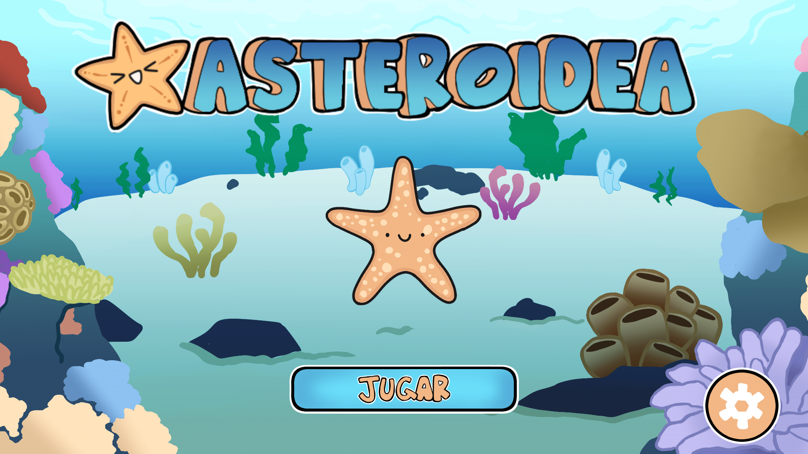

   

# Asteroidea

A little starfish is curious to explore the ocean, diving into the depths of an underwater adventure. How deep can it get? What sort of creatures will it come across with?

This is a game being developed by students from <a href="https://www.imagecampus.edu.ar/">Image Campus</a>

   

## Credits

- **Micaela Luz Benitez** - *Programming*
- **Guido Tello** - *Programming*
- **Melina Klurfan** - *Art*
- **Santiago Lafosse** - *Art*
- **Federico Diaz** - *Testing*
- **Lucas Massei** - *Testing*
- **Isidoro Jaimovich** - *Testing*
- **Rodrigo Abrahan Cerimeli** - *Audio*
- **Pablo Julian Luna** - *Audio*

This game was also possible thanks to the support of these professors:

- **Sergio Baretto**
- **Ignacio Mosconi**
- **Ramiro Cabrera**
- **Nicolas Jimenez Lamberti**
- **Federico Olive**

## Acknowledgements

- ****
- ****

## Links

Play it on itch.io: https://meliklur.itch.io/asteroidea
